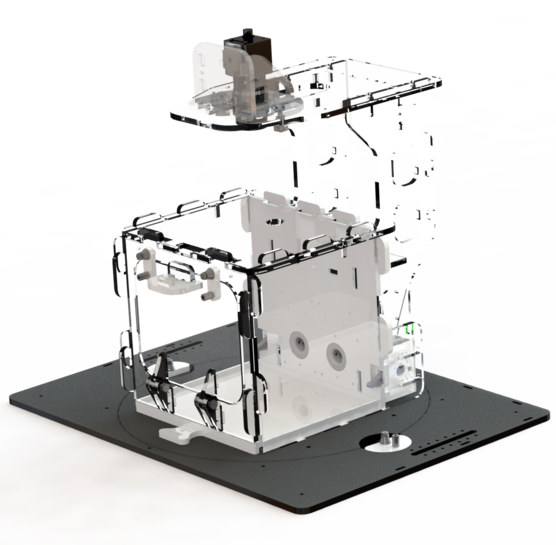

# Behavior Box

## General description

An easy to assemble, low cost and flexible mice behavioral box. It allows the usage of different modular peripherals, with a maximum of two poke detectors with LEDs and two levers.  The removable tray and the easy detachable walls makes it very easy for handling and cleaning the chamber.

The box can be fully assembled using laser cut acrylic and 3D printing parts. The design files  and bill of materials are are available from in this repository.

----

## Licensing 

Each subdirectory will contain a license or, possibly, a set of licenses if it involves both hardware and software.
